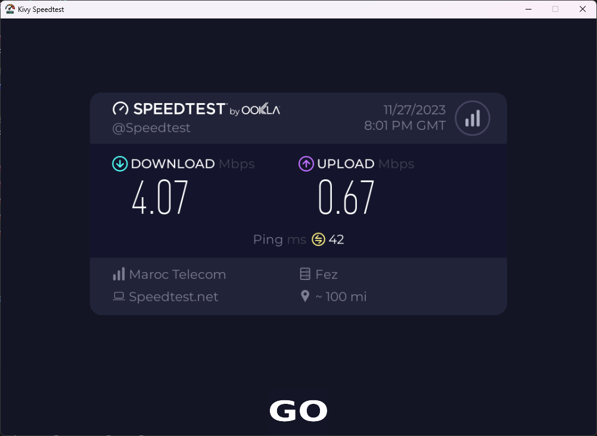

# Kivy Speedtest App

## About

Learning project [python + kivy]

## Screenshots



# Prerequisites
- Python (3.x recommended)
- Kivy (`pip install kivy['base']`)
- Speedtest (`pip install speedtest-cli`)

### Installation
1. Clone the repository:
   ```bash
   git clone https://github.com/your-username/your-repo-name.git
   cd your-repo-name
